# Autores:
* Juan Diego Alvarez Beltran 120688
* Nicolas Rodriguez Diaz 112572

# SIMSCAPE
Simscape es un entorno de simulacion de MATLAB de elementos mecanicos en 3D, simscape genera todas las ecuaciones que simulan el movimiento, matrices de movimiento. La simulacion de simscape se realiza por medio de bloques lo que facilita el entendimiento de estas y el uso.
para el uso de Simscape dentro del entorno de matlab es necesario escribir el siguiente comando en el command window de matlab:

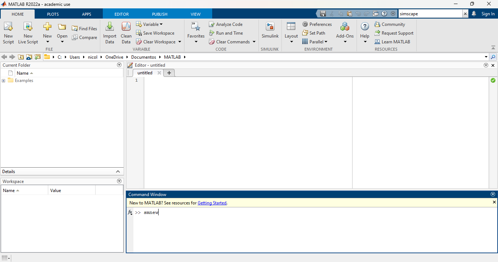

El uso de este simulador requiere de ciertos cambios para poder visualizar de manera correcta el comportamiento de nuestros elementos, para esto cambiamos el eje donde se encuentra la gravedad asignada al eje Y

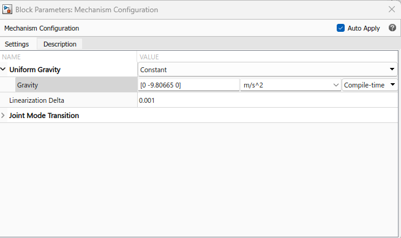
Una vez se cambia la gravedad de eje ya es posible crear un objeto 3d sin que nos genere inconvenientes mas adelantes, es posible realizar cualquier tipo de elemento aunque ya viene por defecto un elemento cubico

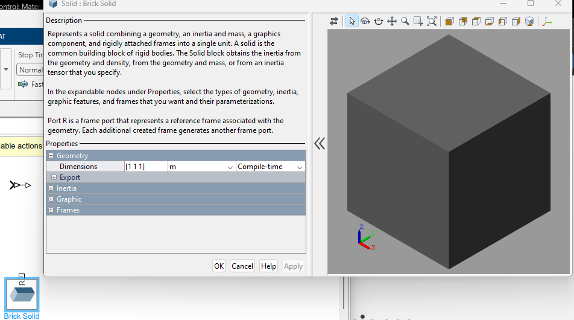
 para crear nuestro pendulo entramos a las configuraciones del objeto y le damos las medidas indicada.
 
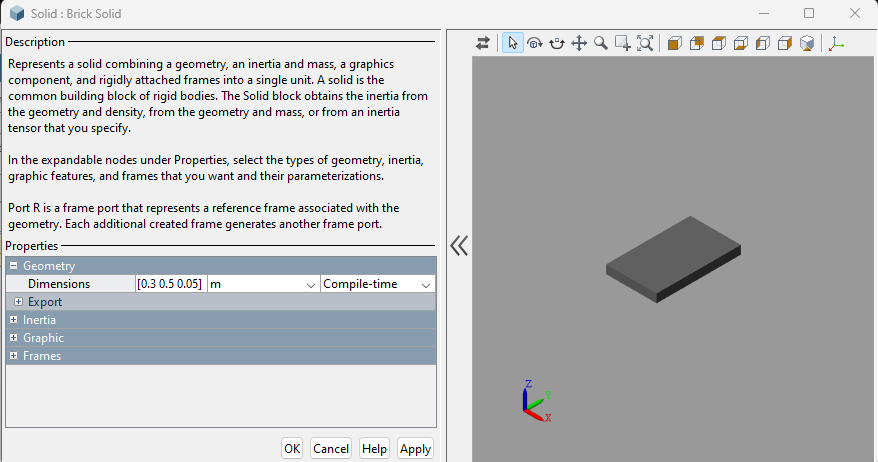
En nuestra figura 3D tendremos un sistema cordenado en donde SimScape tendra encuenta el inicio para el calculo de las matrices de movimiento, pero este sistema cordenado no tiene que ser el unico de la figura, podemos agregar diferentes sistemas cordenados para generar movimiento en diferentes partes de nuestra figura

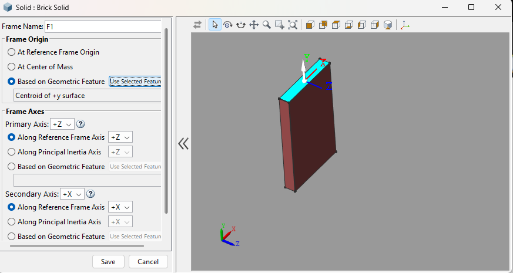
Al aplicar los cambios se puede visualizar el nuevo sistema cordenado en la figura y podremos interactuar con este objeto.
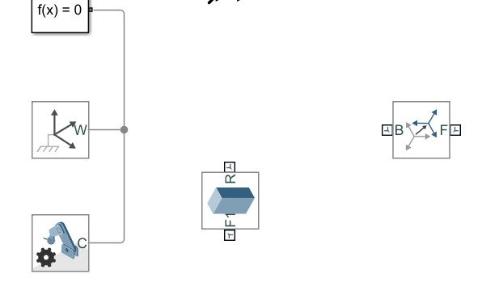
ahora para generar el objeto en nuestro mundo es necesario conectarlo al world frame para que este se conecte por medio del eje cordenado

 Ya que nuestro objeto esta en el World frame tenemos que darle movimiento y esto lo haremos por medio de una junta de revolucion, que nos permitira girar el pendulo creado, pero hay que tener en cuenta que como se cambio la configuracion de la gravedad al eje Y es necesario darle una posicion inicial para que la gravedad sea la que genere el movimiento, dentro de las opciones que nos permite manipular la jjunta de revolucion estan las opciones de los sensores que nos permitiran visualizar el comportamiento de estas variables.
 
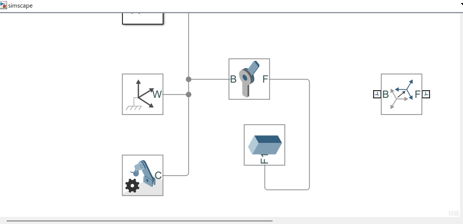
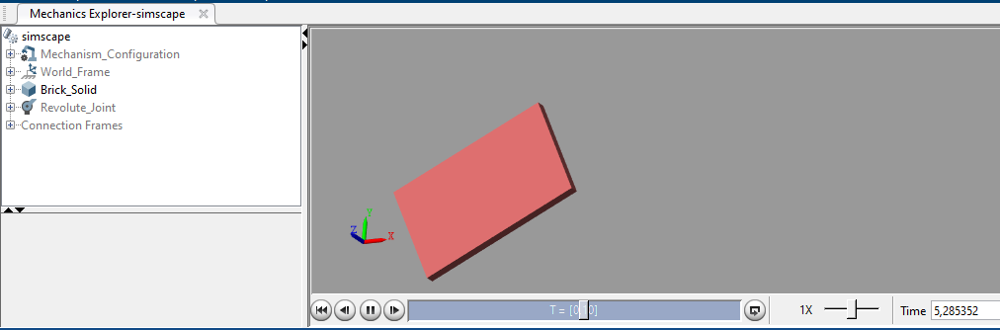

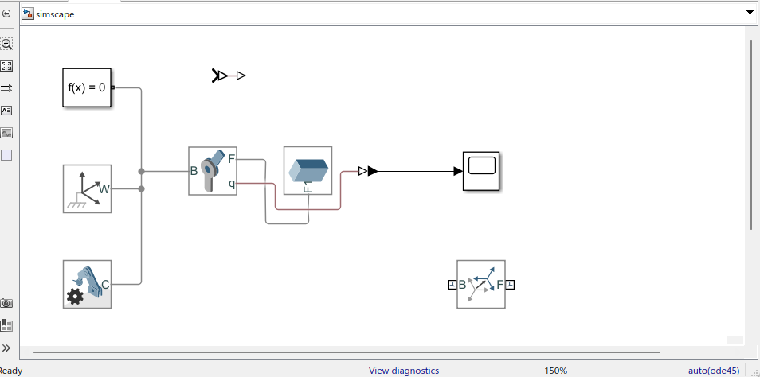
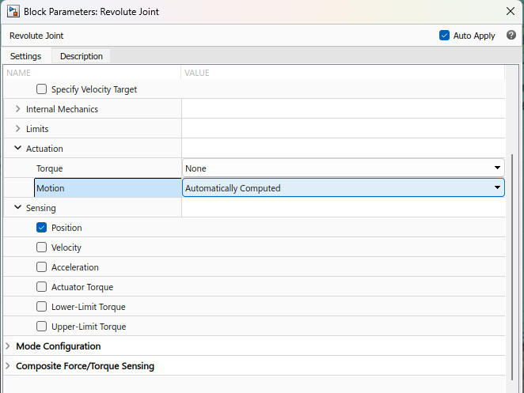

de esta manera ya podremos visualizar en el scope la posicion del pendulo y el comportamiento de este.
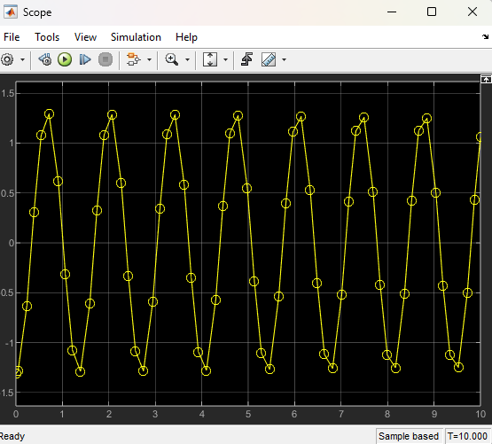

